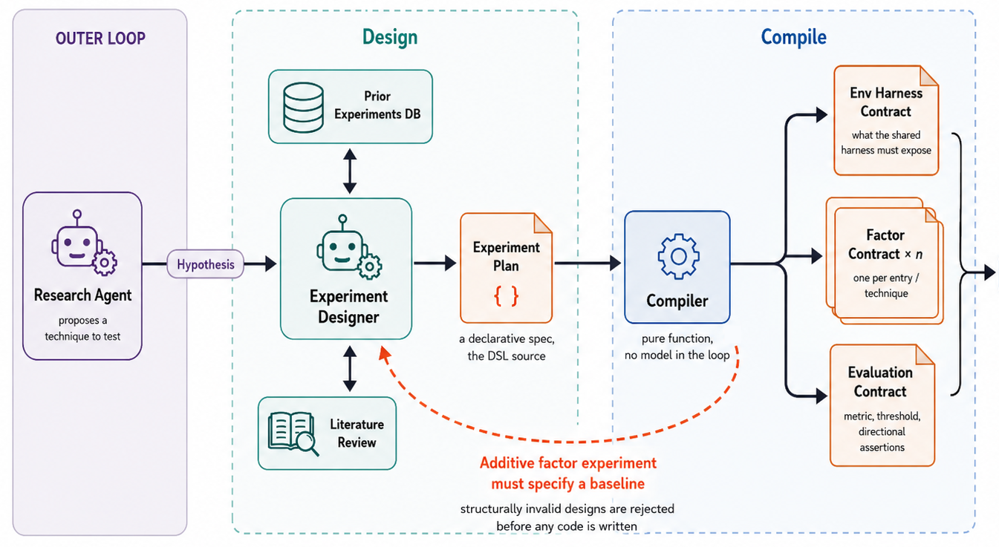
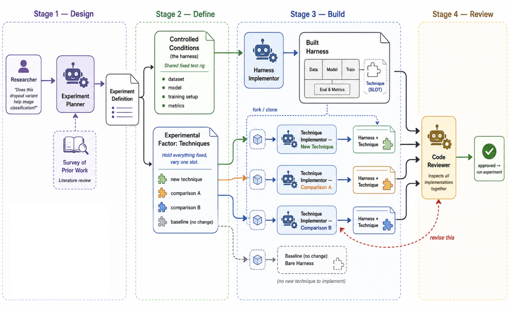

# SMAI

> A framework for automated scientific experimentation that separates agent
> reasoning from scientific verdicts.
> Mechanical guarantees over whatever experiment the agents design.

An automated research system renders a verdict on a hypothesis through a chain of
intermediate work. It designs an experiment, implements and runs it, and
interprets the results, and a flaw anywhere along that chain quietly undermines
the verdict at the end. In most systems the validity of the chain is carried by
prompt context and agent judgment, with nothing checking it. SMAI is the
machinery that chain is missing.

SMAI takes the inferential chain of an experiment (hypothesis, design,
experiment, results, verdict) and makes the validity conditions of each link
explicit. Whatever can be checked mechanically is checked, and what cannot is
handed to an agent deliberately, at the boundary where mechanical checking
genuinely ends. The surface it checks against is intrinsic to the structure that
every valid experiment shares, not a grader wired to one task in advance, so the
guarantees hold over whatever experiment the agents design.

<p align="center">
  
</p>

What that buys, concretely, is a verdict no agent in the loop could have nudged.
The design compiles to a set of frozen, content-hashed contracts before any code
runs, the metric and the verdict function are fixed at that moment, and no LLM
sits anywhere between the raw numbers and the verdict. An agent can implement an
experiment; it cannot grade its own work.

> **Status: private pre-release.** APIs may break without notice. PyPI
> distribution and a public docs site are gated on an explicit decision; until
> then, install from the workspace with `uv sync`. Apache 2.0 licensed.

---

## The reasoning

Two short companion posts lay out why SMAI is built this way, where mechanical
checking ends and agent judgment has to begin:

- [The mechanism boundary in automated research](https://henry-eigen.github.io/2026/05/18/where-agents-belong.html). It argues that an automated research system's reliability comes down to how much of the experiment can be made mechanically checkable.
- [The architecture of mechanized research](https://henry-eigen.github.io/2026/05/13/how-yaarp-works.html). It realizes that argument as SMAI, walked link by link from experiment design through to verdict.

## Installation

Requires [`uv`](https://docs.astral.sh/uv/) and Python 3.11+.

```bash
git clone https://github.com/yaarp-org/smai.git && cd smai
uv sync                 # install the workspace (editable) + dev deps
uv run pytest           # run the test suite
```

There is no PyPI release yet (see the status note above); the `uv` workspace
installs every package and plugin editable.

## Quick start

Boot the laptop deployment with the web UI:

```bash
# Dev defaults: SQLite + local filesystem + local-GPU Docker + Bedrock.
$ uv run smai ui
smai ui: starting in-process worker (sqlite metadata store detected).
         Listening on http://127.0.0.1:8000/
```

Open `http://127.0.0.1:8000/`. In another terminal, submit an experiment and
watch it run to a terminal state:

```bash
$ uv run smai run tests/fixtures/experiments/cutout_on_cifar10.yaml --watch
cg_01J7PA8K2X9F4ZB6QH4N0P1234: complete
```

`smai dev` is the headless equivalent (same plugins, no API or SPA).
`smai compile experiment.yaml` runs only the methodology layer, emitting the
four contracts to stdout without touching the metadata store or compute. The dev
defaults dispatch real agent and compute calls, so they need credentials and a
local Docker setup; the prerequisites are in [Configuration](#configuration) and
[`packages/smai-cli/README.md`](packages/smai-cli/README.md).

### Programmatic

To delegate the whole pipeline, drive it through `Runtime` (agents,
orchestrator, runtime, and plugins all run):

```python
import asyncio
from smai_cli import Runtime, dev_defaults, load_runtime_config

async def main() -> None:
    config = load_runtime_config(defaults=dev_defaults())
    yaml_text = open("tests/fixtures/experiments/cutout_on_cifar10.yaml").read()

    async with Runtime.start_in_band(config) as runtime:
        # A multi-factor experiment registers N comparison groups; single-factor returns one.
        cg_ids = await runtime.experiments.submit_text(yaml_text)
        for cg_id in cg_ids:
            snap = await runtime.status.wait_for_terminal(cg_id, timeout=None)
            print(f"{cg_id}: {snap.state}")

asyncio.run(main())
```

The primary input path is proposals rather than raw definitions.
`runtime.proposals.submit(...)` hands the planner a technique description, it
drafts a definition into the `designed` state, and a human gate approves it,
which registers the comparison groups. Production deployment (out-of-band
worker, Postgres + S3 + remote compute) uses `Runtime.start_worker(...)`;
recipes are in [`packages/smai-cli/OPERATIONS.md`](packages/smai-cli/OPERATIONS.md).

To take only the methodology layer and run the experiments on your own
infrastructure, import `smai_core` alone, no pipeline:

```python
from smai_core import compile_experiment, evaluate

contracts = compile_experiment(document, registries)   # raises VerificationError if confounded
# ... run the experiment on your own infrastructure, gather raw multi-seed metrics ...
result = evaluate(contracts.validation_config, raw_metrics)
print(result.verdict.result)   # "pass" | "fail" | "inconclusive"
```

`smai_core`'s entire dependency list is `pydantic` + `jsonschema` + stdlib, so
it drops into any stack. The DSL, the compiler checks, the contract shapes, and
a worked Tier-B example are in
[`packages/smai-core/README.md`](packages/smai-core/README.md).

## Architecture

SMAI is two layers, and they have opposite shapes.

**The methodology layer is one library, `smai-core`.** No agents, no network, no
orchestrator. It takes a definition, verifies the claim is answerable, emits the
four immutable contracts, and (once raw multi-seed metrics exist, from wherever)
produces the verdict. It is atomic; pull a piece out and the others' guarantees
break, so it ships as one tightly-scoped package, and it is where every
guarantee in [What you get](#what-you-get) is enforced.

**The pipeline layer is everything that produces those metrics for you.** Agents
draft the definition, write the harness, fill in each technique implementation,
and review the diffs; an orchestrator drives the state machines and the worker
loop; four plugin interfaces wire it to an LLM, a metadata store, an artifact
store, and compute. It is composable, every piece independently useful, which is
exactly why you can drop it and run `smai-core` against your own infrastructure.

<p align="center">
  
</p>

The repo is a `uv` workspace, each package its own `pyproject.toml` / `src/` /
`tests/` tree. `smai-core` depends on nothing else in the workspace; the
pipeline packages (`smai-runtime`, `smai-agents`, `smai-orchestrator`,
`smai-api`, `smai-cli`, and the SSE/UI packages) depend on `smai-core`; the CLI
depends on everything. The full dependency graph and the package roster are in
[`CONTRIBUTING.md`](CONTRIBUTING.md).

## Plugins

SMAI has four pluggable boundaries, and it talks to a Protocol at each one, never
a vendor SDK. Every reference implementation ships in this repo, so the OSS
package is self-contained, and discovery is entry-point based (the dbt-adapter
pattern).

<p align="center">
  
</p>

Swapping `sqlite`→`postgres`, `localfs`→`s3`, and `localgpu`→`modal`/`runpod` is
the entire local-to-production migration, a config change rather than a code
change. Each plugin lives under [`plugins/`](plugins/) with its own README for
config keys and credentials. Writing a new one means subclassing the conformance
test base from `smai_core.plugins.conformance`, overriding one factory, and
declaring the entry point; the guide is in [`CONTRIBUTING.md`](CONTRIBUTING.md).

## Configuration

`smai dev` and `smai ui` boot with no config file. Past that, settings layer:
in-code defaults, then `smai.yaml`, then `SMAI_*` env vars, then CLI flags, each
overriding the last. A minimal `smai.yaml` names one plugin per boundary:

```yaml
plugins:
  llm_provider:   bedrock     # bedrock | anthropic | openai
  metadata_store: sqlite      # sqlite | postgres
  artifact_store: localfs     # localfs | s3
  compute:        localgpu    # localgpu | modal | runpod
```

The same file works for `smai dev` and `smai start`; the only difference is
which fields are defaulted versus required. `smai init` scaffolds an annotated
`smai.yaml`, and `smai verify` pings every configured plugin before a run. The
full reference (search order, the `SMAI_*` conventions, per-plugin `*_config`
keys, per-role agent models) is in
[`packages/smai-cli/README.md`](packages/smai-cli/README.md).

## CLI reference

The `smai` CLI has 16 verbs. The ones you reach for first:

```
smai dev               Boot the headless laptop deployment.
smai ui                Boot the API + SPA process (dashboard + live updates).
smai run <yaml>        Compile + register a comparison group; --watch polls to terminal.
smai submit-proposal   Submit a novel-technique description; the planner drafts the design.
smai compile <yaml>    Methodology only: emit the four contracts. No store, no compute.
smai status [<id>]     Read pipeline-tracking state for a CG, proposal, or paper.
smai verify            Ping every configured plugin; PASS/FAIL per interface.
```

The full verb table and the configuration reference are in
[`packages/smai-cli/README.md`](packages/smai-cli/README.md).

## Worked example

The DSL today expresses single-factor comparative experiments. A definition names
the one factor that varies and pins everything else; this is the additive case,
cutout augmentation present versus absent, with architecture and optimizer held
fixed ([full fixture](tests/fixtures/experiments/cutout_on_cifar10.yaml)):

```yaml
kind: experiment
experiment:
  id: aug_cutout_vs_none_cifar10
  hypothesis: |
    Cutout augmentation improves CIFAR-10 top-1 accuracy over an identical
    pipeline with no augmentation, holding architecture and optimizer fixed.

  factors:
    - name: cutout_augmentation
      type: additive                       # baseline = the factor absent

  controlled_conditions:                   # held fixed across every entry
    dataset:      { name: cifar10, split: standard_50k_train_10k_test }
    architecture: { name: resnet50 }
    optimization: { optimizer: adamw, learning_rate: 0.001, batch_size: 128, epochs: 100 }
    seeds: [42, 1337, 2024, 9999, 55]

  entries:
    - id: no_aug_baseline
      is_baseline: true
      level: { factor: cutout_augmentation, name: absent,  technique_id: null }
    - id: cutout_treatment
      level: { factor: cutout_augmentation, name: present, technique_id: tech_cutout }

  validation:
    metric:      { kind: parametric, family: top_k_accuracy, parameters: { k: 1 } }
    direction:   higher_is_better
    aggregation: { method: mean }
    comparison:  { rule: compare_to_baseline, threshold: 0.003 }
    seed_count_required: 5
```

Compiling it emits the four contracts; running it produces raw metrics; the
evaluator applies the locked `ValidationConfig` and returns a verdict
(`pass` / `fail` / `inconclusive`) with the per-treatment deltas behind it. Make
the comparison confounded, vary two things at once or drop a control, and there
is no verdict to grade because there is no compile:

```python
>>> compile_experiment(confounded_document, registries)
smai_core.verification.VerificationError: verification failed with 1 error(s):
factor.suspected_pipeline_encoding
```

The DSL, the compiler checks, the contract shapes, and a fuller Tier-B walkthrough
are in [`packages/smai-core/README.md`](packages/smai-core/README.md).

## Documentation

| | |
|---|---|
| [The mechanism boundary in automated research](https://henry-eigen.github.io/2026/05/18/where-agents-belong.html) | The argument for where mechanical checking ends and agent reasoning begins. |
| [The architecture of mechanized research](https://henry-eigen.github.io/2026/05/13/how-yaarp-works.html) | That argument realized as a working system. |
| [`packages/smai-core/README.md`](packages/smai-core/README.md) | The experiment DSL, the compiler checks, the four contracts, `evaluate()`. |
| [`packages/smai-cli/README.md`](packages/smai-cli/README.md) | The 16 CLI verbs and the full configuration reference. |
| [`CONTRIBUTING.md`](CONTRIBUTING.md) | Repo layout, dependency graph, dev setup, the CI gates, the plugin-author guide. |
| [`packages/smai-cli/OPERATIONS.md`](packages/smai-cli/OPERATIONS.md) | Production deployment recipes: systemd / launchd, pool sizing, bearer-token mode. |

## Contributing

See [`CONTRIBUTING.md`](CONTRIBUTING.md) for repo layout, local-dev setup, the
project conventions, and the plugin-author guide. The four plugin Protocols ship
parameterizable conformance test bases under `smai_core.plugins.conformance`: a
new plugin subclasses one, overrides a factory, and inherits the contract suite.

## License

Apache 2.0, see [`LICENSE`](LICENSE). The SDK, DSL, agent loops, contracts,
runtime, mechanical evaluator, HTTP API, SPA, and reference plugin
implementations all ship under Apache 2.0.
